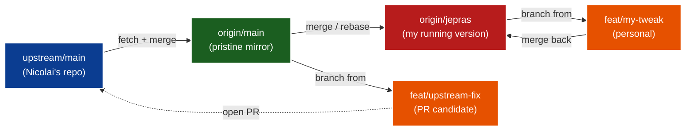
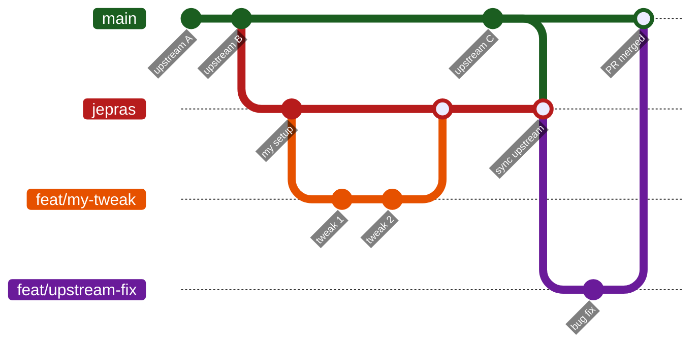
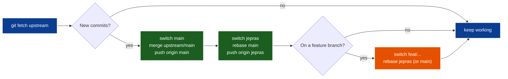

# Jepras GitHub Fork Workflow
My personal cheatsheet for working on this fork of `NicolaiLassen/orxhestra`.

## Mental model

- `origin` = **your fork** on GitHub (you have write access)
- `upstream` = **Nicolai's original repo** (read-only to you)
- `main` = keep clean, mirror of `upstream/main`, never commit directly
- `jepras` = your personal long-lived branch — your "running version" with accumulated tweaks
- `feat/<name>` = short-lived feature branches, branched from `main` (PR-bound) or `jepras` (personal)



## Branching strategy (hybrid)

| Branch | Purpose | Parent | Lifetime |
|---|---|---|---|
| `main` | Pristine mirror of `upstream/main` | `upstream/main` | Forever |
| `jepras` | Your personal version with all your tweaks | `main` | Forever |
| `feat/<name>` (personal) | Personal change, merges back to `jepras` | `jepras` | Short |
| `feat/<name>` (PR) | Change intended for PR to upstream | `main` | Short |

**Where to branch from:**
- Planning to PR upstream → branch from `main`
- Personal tweak → branch from `jepras`

GitHub shows the author on every PR and commit, so no special prefix is needed to identify your work.



## Daily workflow



### 1. Start a feature intended for PR upstream (from `main`)

```bash
git switch main
git fetch upstream
git merge upstream/main        # sync main with upstream
git push origin main           # update your fork's main
git switch -c feat/feature1
```

### 2. Start a personal tweak (from `jepras`)

```bash
git switch jepras
git switch -c feat/my-tweak
# ... edit, commit ...
git switch jepras
git merge feat/my-tweak
git push origin jepras
```

### 3. Pull in upstream changes mid-feature

```bash
# sync main with upstream
git switch main
git fetch upstream
git merge upstream/main
git push origin main

# bring upstream into your personal branch (rebase is safe — jepras is only yours)
git switch jepras
git rebase main
git push origin jepras

# bring those updates into your feature branch
git switch feat/feature1         # your feature branch
git rebase main                  # or: git rebase jepras, depending on parent
```

Do this often (weekly-ish) — small conflicts beat huge ones.

### 4. Check for upstream changes without merging

```bash
git fetch upstream                              # downloads into local cache, safe
git log main..upstream/main --oneline           # what's new
git diff main upstream/main                     # actual code diff
```

`git fetch` never touches your working files.

## Handling merge conflicts

1. Git tells you which files conflict — `git status` lists them
2. Open each file, find the markers:
   ```
   <<<<<<< HEAD
   your version
   =======
   their version
   >>>>>>> upstream/main
   ```
3. Edit manually, remove markers, keep what you want
4. `git add <file>` then `git merge --continue` (or `git rebase --continue`)
5. Bail if messy: `git merge --abort` / `git rebase --abort`

## Proposing changes back to Nicolai

```bash
# push your branch
git push -u origin feat/feature1

# open PR via CLI
gh pr create --repo NicolaiLassen/orxhestra
```

Or via GitHub UI: visit your fork → "Compare & pull request" banner → submit.

Nicolai reviews → you push more commits to the same branch → PR auto-updates → he merges (or not).

## Rules of thumb

- **Never commit to `main`** — keep it as a pristine mirror of upstream
- **Sync often** — weekly `git fetch upstream` + merge into your main
- **Push branches, not main changes** — your fork's `main` only ever moves via upstream syncs
- **`fetch` is always safe** — it only downloads, can't break anything
- **Rebase on personal branches, merge on shared ones** — `jepras` and `feat/*` are yours → safe to rebase
- **Nothing is lost if pushed** — worst case, delete fork and re-fork; cherry-pick good commits back
